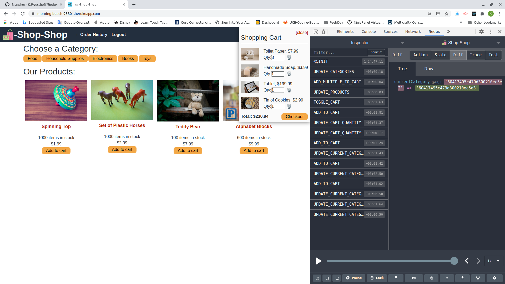

  # Project Title: Redux Store 
  ### 
  
  ## Table of contents:
  1. [Title](#Project-Title)
  1. [License](#License)
  1. [Project Description](#Project-Description)
  1. [Installation](#Installation-Instructions)
  1. [Useage](#How-To-Use)
  1. [How to Contribute](#How-to-Contribute)
  1. [Test Instructions](#Test-Instructions)
  1. [Questions](#Questions)

  ## License: 
  ### This project is licensed under Apache 2.0 License (click on icon near the top):
  or here: [Apache 2.0 License](https://opensource.org/licenses/Apache-2.0)
 

  ## Project Description:
  Changeover from React context state management to Redux.
  This was done by:
  * Implementting a store using [react-redux](https://react-redux.js.org/) and [redux-thunk](https://www.npmjs.com/package/redux-thunk) middleware
    * see the "Store" folder in "client/src/store"
  * Adapt and import the reducers for Redux use
    * see client/src/reducers/reduxReducers.js
  * Import the new state and dispatch functions from the redux store in all the occasions where the original context store was used:
    * import store from `"../store/store"`
    * comment out: `//const [state, dispatch] = useStoreContext();`
    * add:
      * `const state = store.getState();`
      * `const dispatch = store.dispatch;` 

  ## Installation Instructions:
  Fork it on github: https://github.com/KJWesthoff/Redux
  ## How To Use
  Its deployed here: https://morning-beach-95801.herokuapp.com/
  ### Redux chrome tools
  It is highly recommended to install the redux chrome tools [link](https://chrome.google.com/webstore/detail/redux-devtools/lmhkpmbekcpmknklioeibfkpmmfibljd?hl=en) to see what is happening in the storage, see image below:
  ###
  

  ## How to Contribute:
  * Checkout the github repo, any suggestions or bugfixes are very welcome
  * Checkout the github repo and please raise any issues with Redux Store you come across 
  * Even better - help with bugfixes and features by submitting your solutions in pull requrets for the repo
  * Follow the code of coduct for contribution outlined in [Contributor Covenant](https://www.contributor-covenant.org/) 
  ## Test Instructions
  ### The testing strategy is as follows
  #### No test implemented for now

  ## Questions
  Feel free to reach out either in the projects GitHub page or send an email to the address below
  ### Github page:
  [GitHub](https://github.com/KJWesthoff/Redux)
  ### email:
  [karl.johan.westhoff@gmail.com](mailto:karl.johan.westhoff@gmail.com) 
